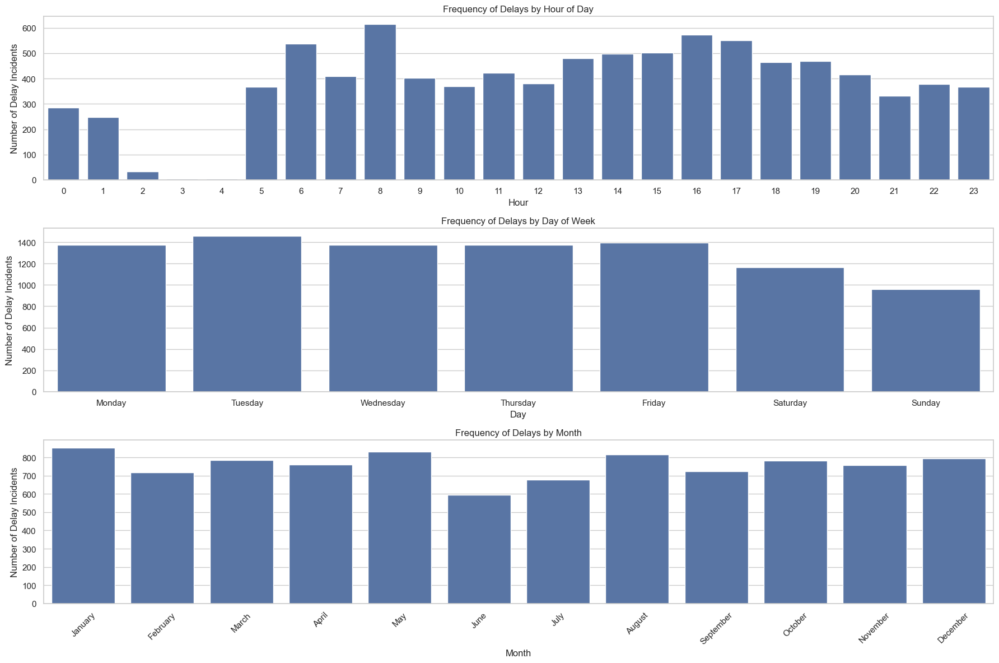
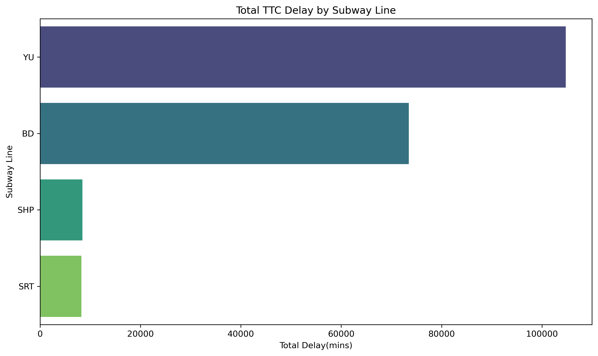
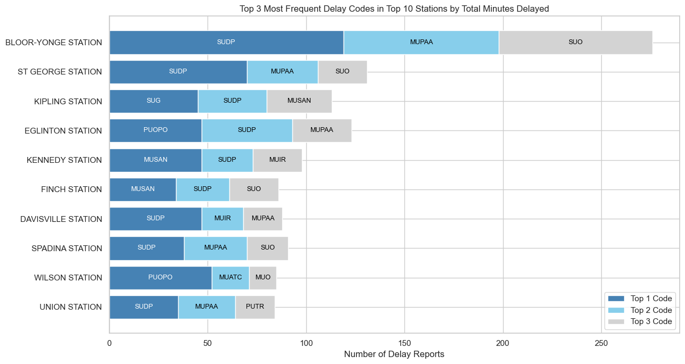
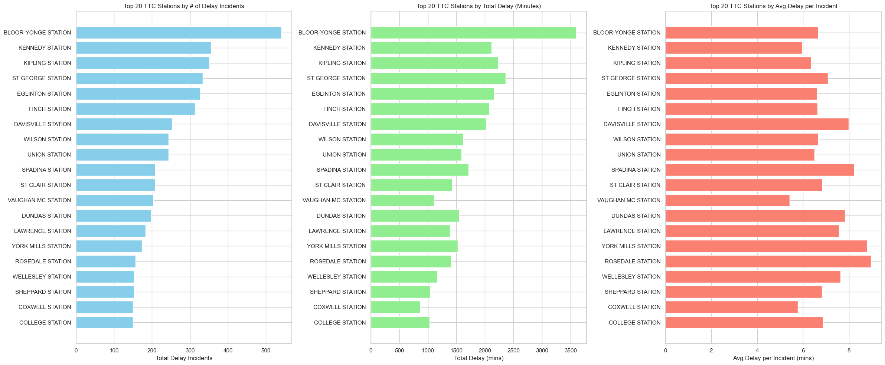
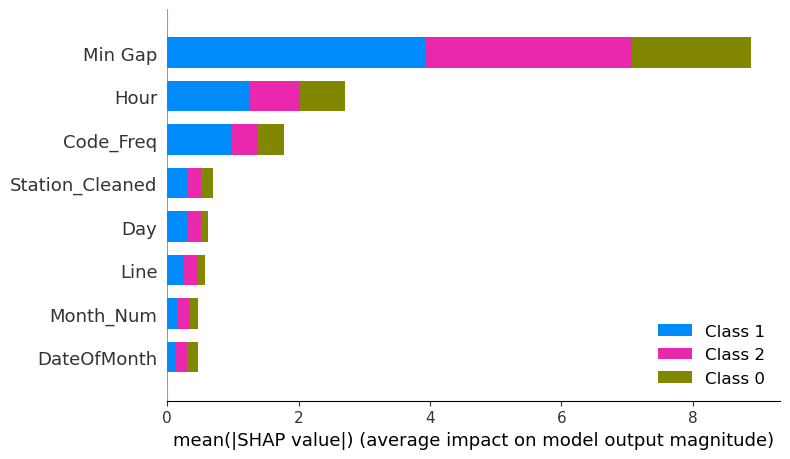
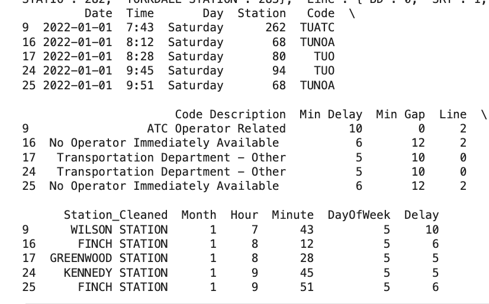
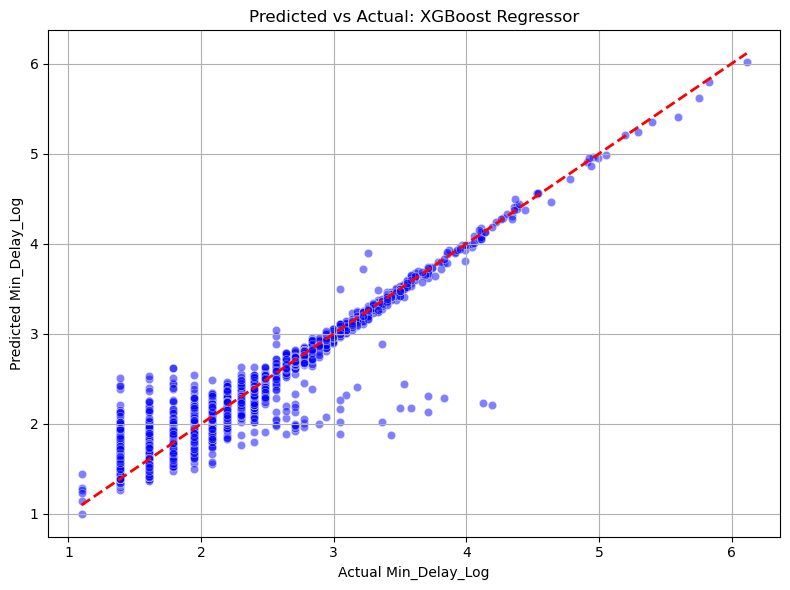

# Forecasting TTC Subway Delays (2022–2024)

We explored three years of Toronto’s TTC subway delay logs to uncover patterns, build predictive models, and deliver insights that can help the TTC improve service reliability, optimize staffing, and inform commuters of potential issues—before they happen.  
This project includes classification and regression models using real-world transit data, with interpretable outputs and visualizations to support stakeholder understanding and future action.

---

## Table of Contents
- [Problem Context](#problem-context)
- [Business Objective](#business-objective)
- [Dataset Summary](#dataset-summary)
- [Project Scope](#project-scope)
- [Methodology](#methodology)
  - [Data Cleaning](#data-cleaning)
  - [Feature Engineering](#feature-engineering)
- [Delay Code Legend](#delay-code-legend)
  - [Exploratory Data Analysis](#exploratory-data-analysis)
  - [Classification Modeling](#classification-modeling)
  - [Regression Modeling](#regression-modeling)
- [Key Findings](#key-findings)
- [Glossary](#glossary)
- [Team & Contributions](#team--contributions)
- [Next Steps](#next-steps)

---

## Problem Context

“Sorry, I’m running late — the TTC’s delayed again.”

TTC subway riders regularly experience unexpected delays — over time this has a negative impact, losing trust, credibility and reliability. Without knowing which delay types and times are most disruptive and likely to reoccur, TTC staff may struggle to prioritize response efforts and improve their customer experience.

- In 2023 alone, the TTC logged over **23,000 subway delays** ([TTC Service Summary](https://www.ttc.ca/-/media/Project/TTC/DevProto/Documents/Home/Transparency-and-accountability/Service-Summary_2022-11-20.pdf))
- **Line 1 alone impacts more than 625,000 daily riders** ([TTC Subway Ridership](https://cdn.ttc.ca/-/media/Project/TTC/DevProto/Documents/Home/Transparency-and-accountability/Subway-Ridership-20232024.pdf))
- **Monthly subway delay minutes rose 53% since 2019**: from 3,853 → 5,903 minutes/month ([City Hall Watcher, 2023](https://toronto.cityhallwatcher.com/p/chw257?utm_source=chatgpt.com))

**Estimated Economic Impact of Delays:**

| Estimate Source | Metric | Delay Cost Assumption | Monthly Cost | Annual Cost |
|------------------|--------|------------------------|------------------|-----------------|
| NYC Comptroller (2017) | Major delay cost | $50–$100/minute | ~$295,000+ | ~$3.5M+ CAD |
| Modeled for TTC | 5,903 delay mins × $50 CAD/min | Conservative | ~$295,150 | ~$3.54M |

([ITS Canada Transit Delay Study](https://www.itscanada.ca/files/ITS%20Student%20Competition_Alaa%20Itani.pdf))

---

## Business Objective

We aimed to identify patterns in subway delay incidents and build predictive tools for:

- Classifying delays by severity
- Forecasting expected delay duration
- Revealing operational hotspots by station, line, and delay code

These insights help support:

- Proactive staffing and resource planning
- Transparent public communication
- Data-driven improvements to transit reliability

---

## Dataset Summary

- **Source:** [Open Data Toronto - TTC Subway Delay Data](https://open.toronto.ca/dataset/ttc-subway-delay-data/)
- **Used for Feature Engineering and Modeling:** 69,071 cleaned entries from 2022–2024

---

## Project Scope

- **Lines included:** Subway-only (Line 1: YU, Line 2: BD, Line 3: SRT, Line 4: SHP)
  - YU = Yonge-University, BD = Bloor-Danforth, SRT = Scarborough RT, SHP = Sheppard Line
- **Focus:** Controllable operational delays
- **Excluded:** Bus/streetcar records, vehicle #, bound, external factors like weather
- **Modeling Goal:** Build interpretable classification and regression models using XGBoost and Random Forest

---

## Methodology

### Data Cleaning
- Corrected misspelled and inconsistent station names
- Concatenated data across 3 years (2022-2024)
- Dropped features with excessive null values: BOUND, VEHICLE

### Feature Engineering
- Focused on 2022-2024 data (69,071 records)
- Derived hour, day, month, and min gap
- Label encoding for delay codes and station names
- Created delay severity classes for classification
  
---

## Delay Code Legend

Below are the most frequently recurring delay codes in this dataset. These appear across multiple charts and were key drivers in both classification and regression models.

| Code | Description |
|------|-------------|
| SUDP | Unruly customer |
| MUPAA | Passenger alarm, no issue found |
| SUO | Security or passenger-other |
| TUNOA | No operator immediately available |
| TUO | Operator-related delay |
| TUNIP | Operator Not In Position |
| TUS | Schedule-related delay |

---

## Exploratory Data Analysis

- Frequency of Delays by Time and Location  
  

- Average Delay per Subway Line  
  

- Top 3 Delay Codes at Top 4 Stations vs. Union Station  
  

- Top 4 Stations vs. Union Station by Volume  
  

---

## Classification Modeling

- **Target:** Delay severity class  
  - Class 0: Long Delay (>10 min)  
  - Class 1: No Delay (0 min)
  - Class 2: Short Delay (<10 min)

- Models Tested: Random Forest, Tuned XGBoost

### Summary: Tuned XGBoost slightly outperformed Random Forest across all classes, especially for identifying long delays.

#### Random Forest Classifier Results

| Class | Precision | Recall | F1-Score | Support |
|-------|-----------|--------|----------|---------|
| 0 (No Delay)        | 0.93 | 0.90 | 0.92 | 1,025 |
| 1 (Short Delay)     | 0.99 | 1.00 | 0.99 | 8,499 |
| 2 (Long Delay)      | 0.98 | 0.97 | 0.97 | 4,290 |
| **Accuracy**        | —    | —    | **0.98** | 13,814 |
| **Macro Avg**       | 0.97 | 0.96 | 0.96 | — |
| **Weighted Avg**    | 0.98 | 0.98 | 0.98 | — |

#### Tuned XGBoost Classifier Results

| Class | Precision | Recall | F1-Score | Support |
|-------|-----------|--------|----------|---------|
| 0 (No Delay)        | 0.94 | 0.92 | 0.93 | 1,025 |
| 1 (Short Delay)     | 0.99 | 1.00 | 1.00 | 8,499 |
| 2 (Long Delay)      | 0.98 | 0.98 | 0.98 | 4,290 |
| **Accuracy**        | —    | —    | **0.98** | 13,814 |
| **Macro Avg**       | 0.97 | 0.96 | 0.97 | — |
| **Weighted Avg**    | 0.98 | 0.98 | 0.98 | — |

### Interpretation:
- **Precision** reflects how many of the predicted delays in each class were correct.
- **Recall** reflects how many actual delays the model successfully captured.
- **F1-Score** balances both, making it a strong metric for delay prediction accuracy.
- **High Class 2 performance** (F1 = 0.98) is key: it means we can **reliably flag long, costly delays** before they escalate.

- SHAP Summary Bar Plot  
  

---

## Regression Modeling

We trained a log-transformed regression model to estimate **how long a delay might last**, given station, time, and operational context.

- **Target Variable**: `Min Delay` (log-transformed)
- **Best Model**: XGBoost Regressor (lowest RMSE, highest R²)
- **Performance**: Strong performance across most delay durations, especially 2–5 mins

### How to Read This Section

This model doesn’t just classify delays — it predicts actual delay length (in minutes). By log-transforming the target, we handle extreme delay outliers more effectively and produce more stable forecasts. The scatter plot below compares predicted vs. actual delays: points closer to the red line indicate more accurate predictions.

### Feature Highlights

| Feature | Description |
|---------|-------------|
| `Station_Cleaned` | Cleaned subway station name |
| `Code Description` | Reason for the delay |
| `Min Gap` | Time since the previous train |
| `Hour`, `Minute`, `DayOfWeek` | Time-based patterns |

### Sample Training Data  

### Predicted vs Actual Delay  

### Top 3 Features Influencing Subway Delay Predictions 

### What This Means

- **Operator-related delays** were more frequent on Line YU in early morning hours
- **Staffing-related issues** like “No Operator Immediately Available” led to higher delay durations
- **Min Gap** and **Time of Day** were consistently strong predictors of delay severity
- The model demonstrates strong predictive power with log-transformed delay durations, especially between 2–5 minutes (as shown in the plot)

---

## Key Findings
- **Repeat issues cluster** at major stations like Bloor-Yonge and St. George.
- **Top delay causes**:  
  `SUDP` (Unruly Passenger), `MUPAA` (Passenger Alarm – No Issue), `SUO` (Security/Other).
- **Subway delays are more prominent during weekdays**;  
  Specificially in mornings between 6-8AM and evenings between 3-6PM.
- **Delay severity is most influenced by operational variables**, not location:  
  The top predictors across models were `Min Gap`, `Hour of Day`, `Delay Code`, and `Station Name` (confirmed via SHAP).
- **Short delays dominate**, but long delays have outsized impact:  
  While most delays are < 10 minutes, the few longer delays significantly skew average delay minutes, especially on the SRT line.
- **Certain delay codes repeat predictably at specific stations**:  
  Top 4 stations often log recurring `SUDP` and `MUPAA` incidents — suggesting a need for targeted safety or communication strategies.
- **Even "No Delay" entries contain signal**:  
  Zero-delay records still showed patterns in `min_gap` and `station`, helping models correctly classify the “No Delay” class.
---

## Glossary

| Term | Meaning |
|------|---------|
| Line_YU | Yonge-University |
| Line_BD | Bloor-Danforth |
| Line_SRT | Scarborough RT |
| Line_SHP | Sheppard Line |
| SUDP | Unruly customer |
| MUPAA | Passenger alarm, no issue found |
| SUO | Security or passenger-other |
| Min Gap | Minutes to next train |
| Code_Freq | Frequency of delay code |
| Min Delay | Delay duration (minutes) |
| Min_Delay_Log | Log-transformed delay |
| Class 0/1/2 | Delay severity classes |
| SHAP | Model explanation tool |

---

## Team & Contributions

| Name | GitHub | Email | Contributions | Reflection Video |
|------|--------|-------|----------------|------------------|
| Valerie Poon | [@val-poon](https://github.com/val-poon) | valerieyfp@gmail.com | Project planning, documentation, final README | [Video link](https://youtu.be/ukwpFpKvtBU) |
| Sahil Modi | [@smodi23](https://github.com/smodi23) | sahilmodi237@gmail.com | Data cleanup, insights on station/line patterns | [Video Link](https://drive.google.com/file/d/1chSNIFttW3m-Bjk7xk6IqKOK5TQjL_V0/view?usp=sharing) |
| Saad Khan | [@Saadkhan-188](https://github.com/Saadkhan-188) | saadkhan188@gmail.com | Business pitch, GitHub setup, raw data API upload | [Youtube Video](https://youtu.be/DSXkkpaK9M0) |
| Sneha Gupta | [@reachsneha02](https://github.com/reachsneha02) | reachsneha02@gmail.com | Feature engineering, classification + regression |  [Video link](https://youtu.be/QjvRg73T9iY) |
| Sucharitha Sundararaman | [@suchi-dev-ai](https://github.com/suchi-dev-ai) | suchiraman22@gmail.com | Regression pipeline, model tuning, SHAP analysis | [Video Link](https://drive.google.com/file/d/10eqNwlJG_Zgw0ENAtlUi8FWknHTvmMnb/view?usp=sharing) |
| Faiz Shaikh | [@FaizS11](https://github.com/FaizS11) | faizkshaikh11@gmail.com | Code owner, code review, final solution pitch | TBD |

---

## Next Steps

- Final legends/labels in visualizations
- Increase sample size: include historical records 
- Build internal dashboard or reporting tool to visualize forecasts and improve delay awareness across TTC operations
- Investigate why delays occur less frequently at Union Station—despite being a high-traffic hub—and assess whether its operational strategies can be applied to other delay-prone stations

---

## Tools and Libraries Used

| Tool / Library | Purpose |
|----------------|---------|
| Python | Core programming language for data analysis and modelling |
| Flask-API | Data Extraction from [@Open Data Toronto](https://www.toronto.ca/city-government/data-research-maps/open-data/) |
| pandas | Data manipulation, cleaning, and feature engineering |
| NumPy | Numerical operations and array handling |
| matplotlib & seaborn | Data visualization and exploratory analysis |
| scikit-learn | Model training, preprocessing, and evaluation |
| XGBoost | Gradient boosting for classification and regression |
| Random Forest | Ensemble-based classification and regression model for delay prediction |
| SHAP | Model interpretability and global feature analysis |
| Jupyter Notebook | Development and experimentation environment |
| Custom API for data download | Scripted data download from Toronto’s Open Data portal |
