# Forecasting TTC Subway Delays (2022–2024)

We explored three years of Toronto’s TTC subway delay logs to uncover patterns, build predictive models, and deliver insights that can help the TTC improve service reliability, optimize staffing, and inform commuters of potential issues—before they happen.  
This project includes classification and regression models using real-world transit data, with interpretable outputs and visualizations to support stakeholder understanding and future action.

---

## Table of Contents
- [Problem Context](#problem-context)
- [Business Objective](#business-objective)
- [Dataset Summary](#dataset-summary)
- [Project Scope](#project-scope)
- [Methodology](#methodology)
  - [Data Cleaning](#data-cleaning)
  - [Feature Engineering](#feature-engineering)
  - [Exploratory Data Analysis](#exploratory-data-analysis)
  - [Classification Modeling](#classification-modeling)
  - [Regression Modeling](#regression-modeling)
- [Key Findings](#key-findings)
- [Glossary](#glossary)
- [Team & Contributions](#team--contributions)
- [Next Steps](#next-steps)

---

## Problem Context

“Sorry, I’m running late — the TTC’s delayed again.”

TTC subway riders regularly experience unexpected delays — over time this has a negative impact, losing trust, credibility and reliability. Without knowing which delay types and times are most disruptive and likely to reoccur, TTC staff may struggle to prioritize response efforts and improve their customer experience.

- In 2023 alone, the TTC logged over **23,000 subway delays** ([TTC Service Summary](https://www.ttc.ca/-/media/Project/TTC/DevProto/Documents/Home/Transparency-and-accountability/Service-Summary_2022-11-20.pdf))
- **Line 1 alone impacts more than 625,000 daily riders** ([TTC Subway Ridership](https://cdn.ttc.ca/-/media/Project/TTC/DevProto/Documents/Home/Transparency-and-accountability/Subway-Ridership-20232024.pdf))
- **Monthly subway delay minutes rose 53% since 2019**: from 3,853 → 5,903 minutes/month ([City Hall Watcher, 2023](https://www.cityhallwatcher.com/))

**Estimated Economic Impact of Delays:**

| Estimate Source | Metric | Delay Cost Assumption | Monthly Cost | Annual Cost |
|------------------|--------|------------------------|------------------|-----------------|
| NYC Comptroller (2017) | Major delay cost | $50–$100/minute | ~$295,000+ | ~$3.5M+ CAD |
| Modeled for TTC | 5,903 delay mins × $50 CAD/min | Conservative | ~$295,150 | ~$3.54M |

([ITS Canada Transit Delay Study](https://www.itscanada.ca/files/ITS%20Student%20Competition_Alaa%20Itani.pdf))

---

## Business Objective

We aimed to identify patterns in subway delay incidents and build predictive tools for:

- Classifying delays by severity
- Forecasting expected delay duration
- Revealing operational hotspots by station, line, and delay code

These insights help support:

- Proactive staffing and resource planning
- Transparent public communication
- Data-driven improvements to transit reliability

---

## Dataset Summary

- **Source:** [Open Data Toronto - TTC Subway Delay Data](https://open.toronto.ca/dataset/ttc-subway-delay-data/)
- **Used for Feature Engineering:** 26,467 cleaned entries from 2024
- **Used for Modeling:** 68,984 cleaned entries from 2022–2024

---

## Project Scope

- **Lines included:** Subway-only (Line 1: YU, Line 2: BD, Line 3: SRT, Line 4: SHP)
  - YU = Yonge-University, BD = Bloor-Danforth, SRT = Scarborough RT, SHP = Sheppard Line
- **Focus:** Controllable operational delays
- **Excluded:** Bus/streetcar records, vehicle #, bound, external factors like weather
- **Modeling Goal:** Build interpretable classification and regression models using XGBoost and Random Forest

---

## Methodology

### Data Cleaning
- Filtered out incomplete records and non-subway lines
- Cleaned inconsistent station and line names
- Dropped non-informative features: RUN, BOUND, VEHICLE

### Feature Engineering
- Focused on 2024 data (26,467 records)
- Derived hour, day, month, and min gap
- One-hot encoding for delay codes and station names
- Created delay severity classes for classification

---

## Exploratory Data Analysis

- Frequency of Delays by Time and Location  
  

- SHAP delay plots  
  

- Average Delay per Subway Line  
  

- Top 3 Delay Codes at 10 Top Stations  
  

- Top 5 Stations by Repeated Delay Codes  
  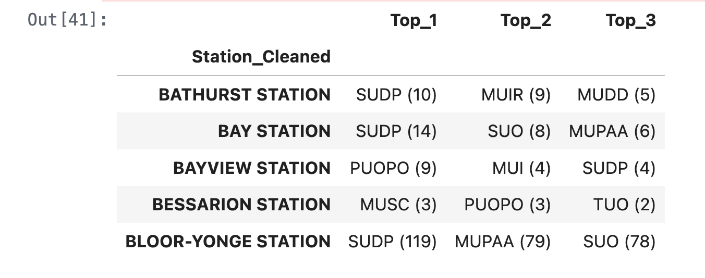

- Top 15 Stations by Volume  
  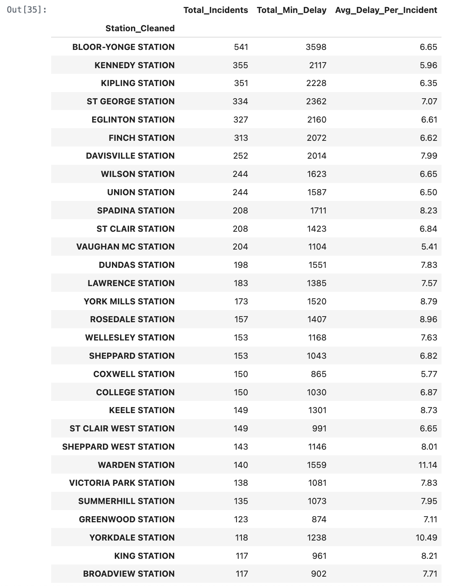

- Station-Specific Trends  
  - Bloor-Yonge (day): 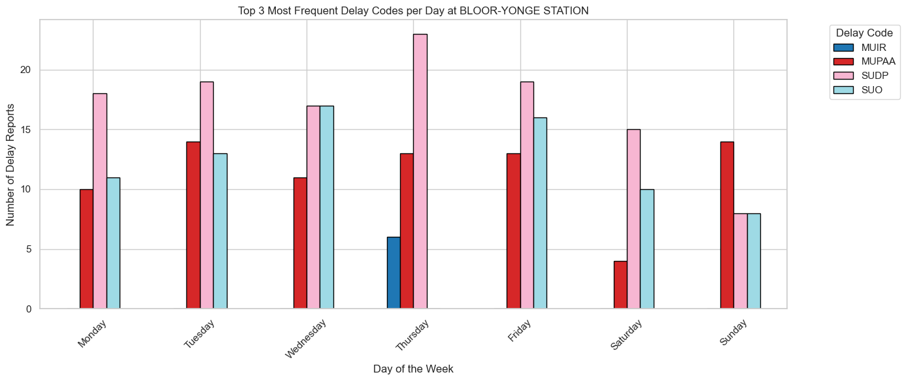  
  - Kennedy (day): 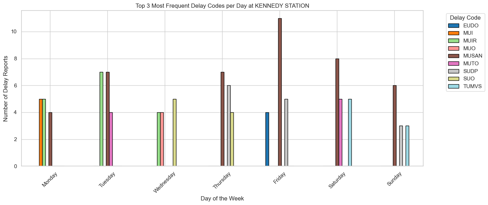  
  - Kipling (day): 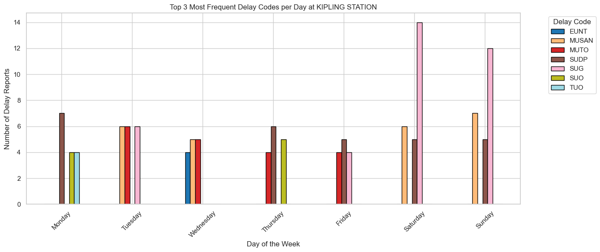  
  - St. George (day): 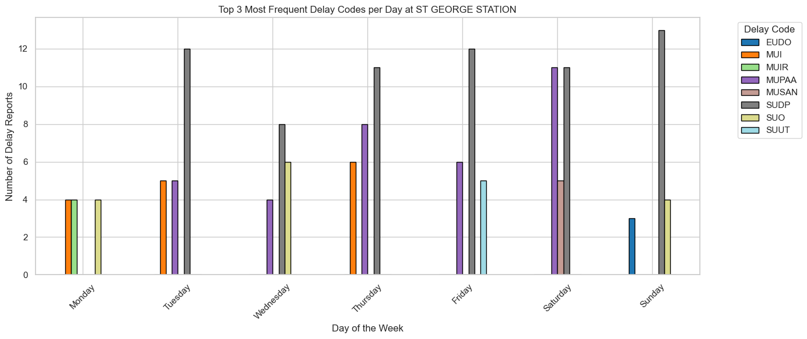  
  - Bloor-Yonge (month): 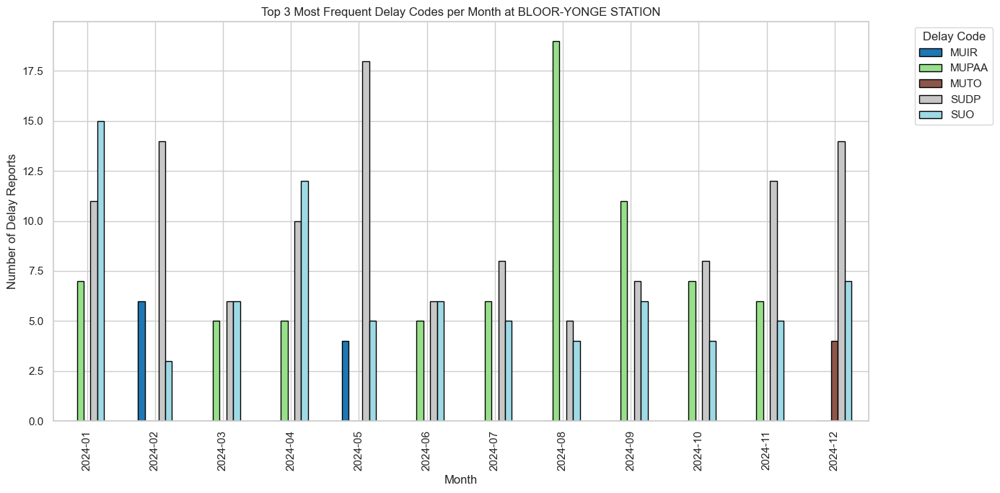  
  - Kennedy (month): 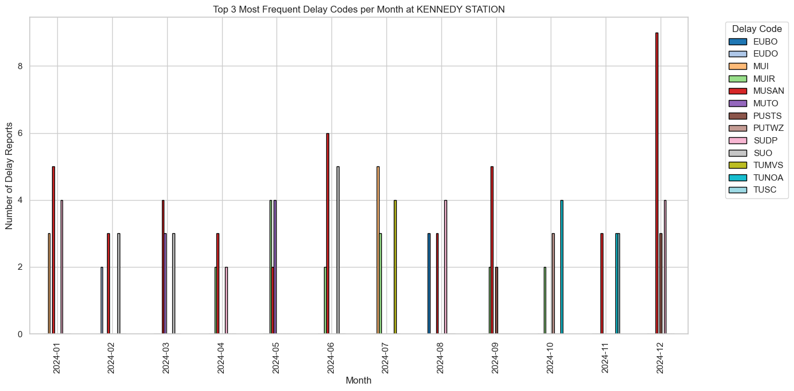  
  - Kipling (month): 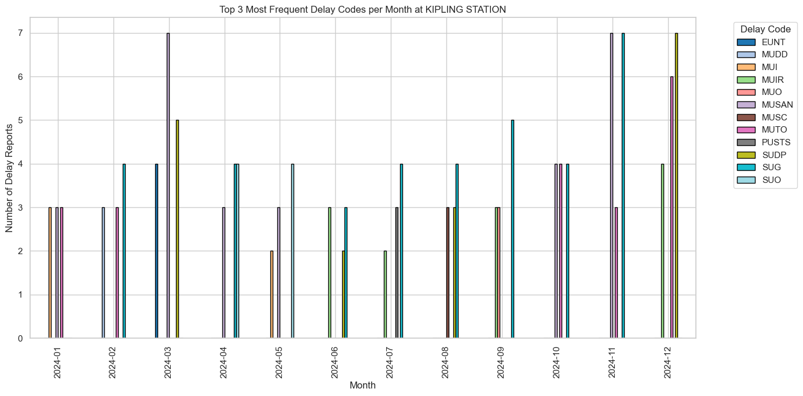  
  - St. George (month): 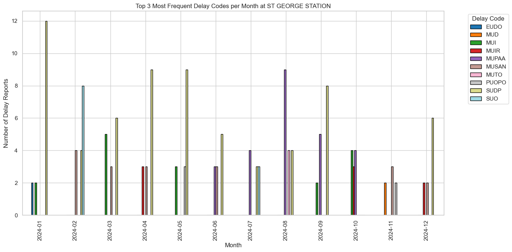

---

## Classification Modeling

- **Target:** Delay severity class  
  - Class 0: Short delay (0–2 min)  
  - Class 1: Moderate delay (3–5 min)  
  - Class 2: Long delay (>5 min)

- Models Tested: Random Forest, Tuned XGBoost

- Random Forest Classification Report  
  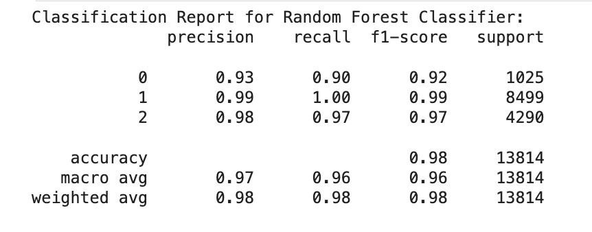

- Tuned XGBoost Classification Report  
  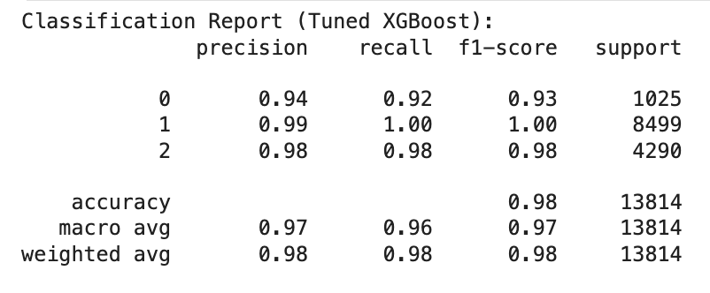

- SHAP Summary Bar Plot  
  

---

## Regression Modeling

- **Target:** Log-transformed delay duration

- Best Parameters and Metrics  
  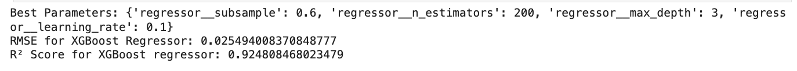

- Predicted vs Actual Delay  
  

---

## Key Findings

- Delays peak during rush hours on Line YU and Line BD
- Repeat issues cluster at major stations like Bloor-Yonge and Kennedy
- Top delay causes: SUDP, MUPAA, SUO
- SRT line delays are longer in early morning; YU midday delays are shorter

---

## Glossary

| Term | Meaning |
|------|---------|
| Line_YU | Yonge-University |
| Line_BD | Bloor-Danforth |
| Line_SRT | Scarborough RT |
| Line_SHP | Sheppard Line |
| SUDP | Unruly customer |
| MUPAA | Passenger alarm, no issue found |
| SUO | Security or passenger-other |
| Min Gap | Minutes to next train |
| Code_Freq | Frequency of delay code |
| Min_Delay | Delay duration (minutes) |
| Min_Delay_Log | Log-transformed delay |
| Class 0/1/2 | Delay severity classes |
| SHAP | Model explanation tool |

---

## Team & Contributions

| Name | GitHub | Email | Contributions | Reflection Video |
|------|--------|-------|----------------|------------------|
| Valerie Poon | [@val-poon](https://github.com/val-poon) | valerieyfp@gmail.com | Project planning, documentation, final README | TBD |
| Sahil Modi | [@smodi23](https://github.com/smodi23) | sahilmodi237@gmail.com | Data cleanup, insights on station/line patterns | TBD |
| Saad Khan | [@Saadkhan-188](https://github.com/Saadkhan-188) | saadkhan188@gmail.com | Business pitch, GitHub setup, raw data API upload | TBD |
| Sneha Gupta | [@reachsneha02](https://github.com/reachsneha02) | reachsneha02@gmail.com | Feature engineering, classification + regression | TBD |
| Sucharitha Sundararaman | [@suchi-dev-ai](https://github.com/suchi-dev-ai) | suchiraman22@gmail.com | Regression pipeline, model tuning, SHAP analysis | TBD |
| Faiz Shaikh | [@FaizS11](https://github.com/FaizS11) | faizkshaikh11@gmail.com | Code owner, code review, final solution pitch | TBD |

---

## Next Steps

- Increase sample size: include historical records from 2014 onward
- Build internal dashboard or reporting tool to visualize forecasts and improve delay awareness across TTC operations
